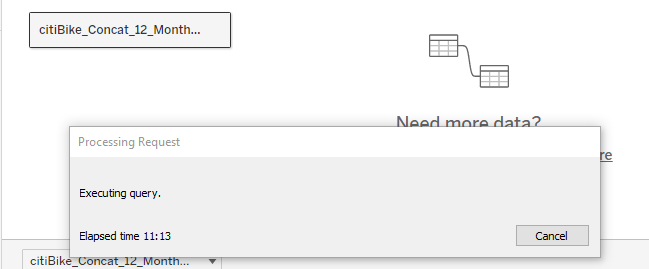
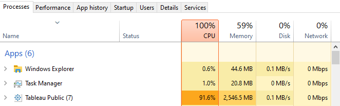
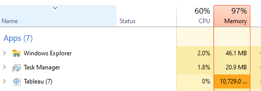
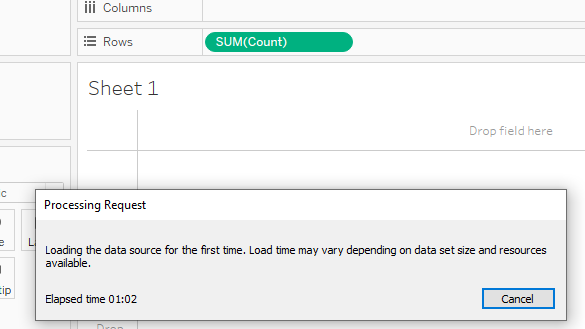
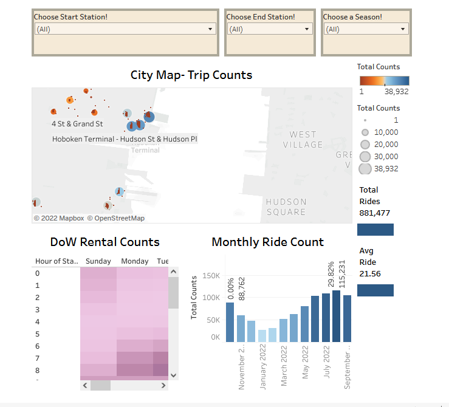
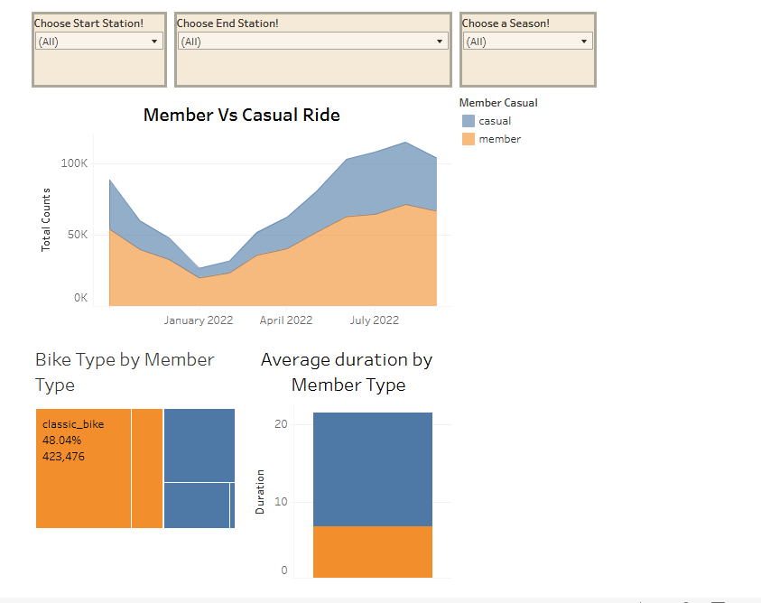
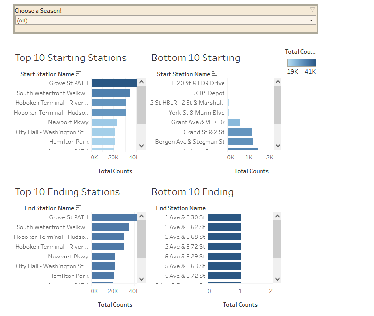
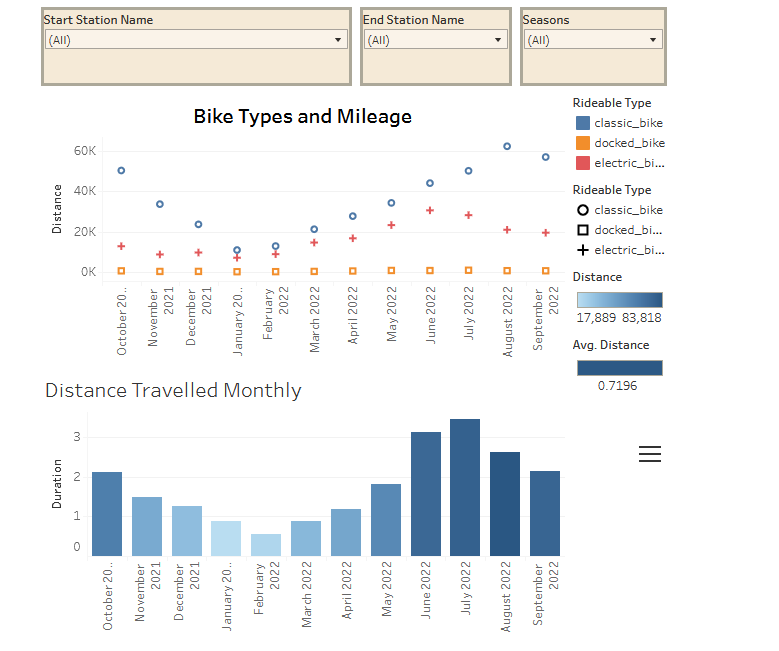

# CitiBike_Tableau
## Link to Tableau Public Dashboard
Found [HERE!](https://public.tableau.com/app/profile/jess.ermovick/viz/CitiBike_JE/CitibikeOverview)
Or download the tableau packaged workbook within Github!
## Instructions
<ol>Steps
<li>Go to [Citi Bike Link!](https://ride.citibikenyc.com/system-data) </li>
<li>Determine a timeframe for which to pull the dataset</li>
<li>Create a series of Dashboards and Stories to answer questions</li>
</ol>
<ol> Questions
<li>  How many trips have been recorded in total during the chosen period?</li>
<li>  By what percentage has total ridership grown?</li>
<li>  How have the proportions of short-term customers and annual subscribers changed?</li>
<li>  What are the peak hours when bikes are used during the summer months?</li>
<li>  What are the peak hours when bikes are used during the winter months?</li>
<li>  Today, what are the top 10 stations in the city for starting a journey? Based on data, why do you hypothesize these are the top locations?</li>
<li>  Today, what are the top 10 stations in the city for ending a journey? Based on data, why?</li>
<li>  Today, what are the bottom 10 stations in the city for starting a journey? Based on data, why?</li>
<li>  Today, what are the bottom 10 stations in the city for ending a journey? Based on data, why?</li>
<li>  How does the average trip duration change by age?</li>
<l1>  What is the average distance in miles for a bike trip?</li>
<l1>  Which bikes (by ID) are most likely due for repair or inspection in the timespan?</li>
<l1>  How variable is the utilization by bike ID?</li>

## ETL
### Extract
Originally decided upon three months of data to give a quarterly look at the trends. This was slightly over 500,000 rows of data, but the questions indicate opposite seasons. As a result, decided to pull 12 months of data- October 2021 to September 2022. 

### Transform
Originally attempted to join the 12 large csv files in Tableau Public. That was not a stellar idea. After a day of attempting to do all the ETL via Tableau without the option for Tableau Prep, or Tableau Desktop without paying for a license, an executive decision was made to use Jupyter notebooks to merge all the csv files into one file. This was only a slightly better idea.

### Load
After getting the data merged using jupyter notebooks, the next task was to load it into Tableau Public. The total time to load the data initially was slightly over 16 minutes:  
 

And this is what it did to my CPU and Memory:  
 

Just attempting to reopen the file was a challenge:  
 

Once it was loaded, the real 'transform' steps happened - even simple steps like creating a SUM was painful! 
 

## Other Items of Note
The Questions being asked did not match the data available for pull. Some questions were not answerable. 
<li>Questions of Rider Age</li>
<li>Questions of Bike Id</li>
<li>Questions of Mainenance Cycles</li>
Only much older data (2017 and earlier) houses these fields. 

## Dashboard Descriptions
### City Map Dashboard
Created to answer questions about percentage of rides, Day of Week rental counts, and geogrphic location questions with interactive filters for start and end station as well as season. 
 
### Member Bike Dashboard
Created to answer questions about membership versus casual riders, the types of bikes chosen for each rider type, and the average duration each rider type spent on the bike. Includes an interactive set of filters for start and end station as well as season.  
 
### Station Details Dashboard
Created to answer the top starting and ending stations as well as the least used starting and ending stations. Interactive filter to choose a season to explore data more closely.  
 
### Distance Dashboard
Created to answer which bike types get the most mileage as well as the monthly distance travelled in general by all the bikes. Includes an interactive set of filters for start and end station as well as season. 
 

### Story Board Overview
Because there were so many interactive dashboards, the concern was that the insights may be overlooked. A consolidated story board that explains the insights gathered at each dashboard helps the audience understand what the data is saying.
